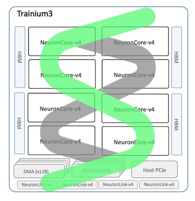

# strands-neuron



vLLM on [AWS Neuron](https://awsdocs-neuron.readthedocs-hosted.com/en/latest/libraries/nxd-inference/vllm/index.html#) infrastructure provider for [AWS Strands Agents SDK](https://github.com/strands-agents/sdk-python).

This package provides a model provider implementation that connects to vLLM servers running on [AWS AI Chips](https://awsdocs-neuron.readthedocs-hosted.com/en/latest/about-neuron/arch/neuron-hardware/trainium.html), enabling high-performance LLM inference with OpenAI-compatible APIs.

## Features

- 🚀 **OpenAI-compatible API** - Works with any OpenAI-compatible vLLM server
- 📡 **Full streaming support** - Async generators for real-time token streaming
- 🛠️ **Tool/function calling** - Native support for function calling and tool use
- 📊 **Structured output** - Generate structured data via tool calls
- ⚡ **Neuron-optimized** - Designed for AWS Neuron hardware acceleration
- 🔧 **Flexible configuration** - Extensive configuration options for model behavior

## Installation

First, clone the repository and create a virtual environment:

```bash
git clone <repository-url>
cd strands-neuron
python3 -m venv .venv
source .venv/bin/activate
```

Install the Strands Agents SDK:

```bash
pip install strands-agents strands-agents-tools
```

Then install the package:

```bash
pip install strands-neuron
```

For development (includes testing and linting tools):

```bash
pip install -e ".[dev]"
```

## Prerequisites

### Hardware Requirements

- AWS EC2 instance with Neuron hardware (e.g., inf2, trn1, trn2 or trn3)
- AWS Neuron Deep Learning AMI (DLAMI) for Ubuntu 22.04

See the [infrastructure README](infrastructure/README.md) for detailed setup instructions.

### Software Requirements

- Python 3.10 or higher
- Running vLLM Neuron server (see [infrastructure setup](infrastructure/README.md))

## Quick Start

### 1. Start the vLLM Neuron Server

First, set up and start your vLLM Neuron server following the [infrastructure README](infrastructure/README.md).

The server should be accessible at `http://localhost:8080/v1` (or your configured endpoint).

### 2. Use NeuronModel in Your Code

```python
from strands import Agent
from strands_neuron import NeuronModel

# Initialize the model
model = NeuronModel(
    config={
        "model_id": "meta-llama/Llama-3.1-8B-Instruct",
        "base_url": "http://localhost:8080/v1",
        "api_key": "EMPTY",  # Not required for local servers
        # "support_tool_choice_auto": True,  # Uncomment if vLLM has --enable-auto-tool-choice flag
    }
)

# Create an agent
agent = Agent(
    system_prompt="You are a helpful assistant.",
    model=model,
)

# Use the agent
response = agent("What is machine learning?")
print(response)
```

### 3. Streaming Example

```python
import asyncio
from strands_neuron import NeuronModel

async def stream_example():
    model = NeuronModel(
        config={
            "model_id": "meta-llama/Llama-3.1-8B-Instruct",
            "base_url": "http://localhost:8080/v1",
            "api_key": "EMPTY",
        }
    )
    
    messages = [{"role": "user", "content": [{"text": "Explain Python"}]}]
    
    async for event in model.stream(messages, system_prompt="You are a coding assistant."):
        if "contentBlockDelta" in event:
            delta = event["contentBlockDelta"].get("delta", {})
            if "text" in delta:
                print(delta["text"], end="", flush=True)

asyncio.run(stream_example())
```

## Configuration

The `NeuronModel` accepts a configuration dictionary with the following options:

### Required

- `model_id` (str): The model identifier (e.g., `"meta-llama/Llama-3.1-8B-Instruct"`)

### Optional

#### API Configuration

- `base_url` (str): Base URL for the OpenAI-compatible API (default: `"http://localhost:8080/v1"`)
- `api_key` (str): API key for authentication (default: `"EMPTY"`)

#### Generation Parameters

- `temperature` (float): Sampling temperature (0.0 to 2.0)
- `top_p` (float): Nucleus sampling parameter
- `max_completion_tokens` (int): Maximum tokens to generate
- `stop` (str | List[str]): Sequences that stop generation
- `stop_sequences` (List[str]): Alternative to `stop` for backwards compatibility
- `frequency_penalty` (float): Penalize tokens based on frequency (-2.0 to 2.0)
- `presence_penalty` (float): Penalize tokens based on presence (-2.0 to 2.0)
- `n` (int): Number of completions to generate
- `logprobs` (bool): Return log probabilities
- `top_logprobs` (int): Number of top log probabilities to return

#### vLLM Server Capabilities

- `support_tool_choice_auto` (bool): Set to `True` if your vLLM server has `--enable-auto-tool-choice` and `--tool-call-parser` flags enabled (default: `False`)

#### Advanced Options

- `additional_args` (Dict[str, Any]): Additional arguments passed to the API request

### Example Configuration

```python
model = NeuronModel(
    config={
        "model_id": "meta-llama/Llama-3.1-8B-Instruct",
        "base_url": "http://localhost:8080/v1",
        "api_key": "EMPTY",
        "temperature": 0.7,
        "top_p": 0.9,
        "max_tokens": 1000,
        "stop_sequences": ["\n\n"],
        "tensor_parallel_size": 2,
        "enable_prefix_caching": True,
    }
)
```

## Examples

This package includes several example implementations:

### Person Info Example (Structured Output)

Demonstrates structured output extraction using Pydantic models:

```bash
python examples/person_example.py
```

### Weather Agent Example

Demonstrates using NeuronModel with tools to create a weather assistant:

```bash
python examples/weather_example.py
```

### Streaming Examples

Shows various streaming patterns:

```bash
python examples/stream_example.py
```

### MCP Integration

Demonstrates Model Context Protocol (MCP) integration:

```bash
cd examples/mcp
python mcp-server.py  # In one terminal
python mcp-example.py  # In another terminal
```

See the [MCP example README](examples/mcp/README.md) for detailed instructions.

## API Reference

### NeuronModel

The main model class that implements the Strands Model interface.

#### Methods

- `stream(messages, tool_specs=None, system_prompt=None, **kwargs)`: Stream responses as async generator
- `structured_output(output_model, prompt, system_prompt=None, **kwargs)`: Generate structured output
- `format_request(messages, tool_specs=None, system_prompt=None, stream=True)`: Format request for API
- `update_config(**config)`: Update model configuration
- `get_config()`: Get current configuration

## Development

### Setup

```bash
# Clone the repository
git clone <repository-url>
cd strands-neuron

# Install in development mode
pip install strands-agents strands-agents-tools pytest
pip install -e ".[dev]"
```

### Running Tests

```bash
# Run all tests
pytest

# Run unit tests only
pytest tests/unit

# Run integration tests only
pytest tests/integration
```

### Code Quality

This project uses:

- **Ruff** for linting
- **Black** for code formatting
- **mypy** for type checking

```bash
# Format code
black src tests

# Lint
ruff check src tests

# Type check
mypy src
```

## Infrastructure

For information on setting up and deploying the vLLM Neuron server, see the [infrastructure README](infrastructure/README.md).

## License

Apache-2.0 License - see [LICENSE](LICENSE) file for details.

## Changelog

See [CHANGELOG.md](CHANGELOG.md) for a list of changes and version history.

